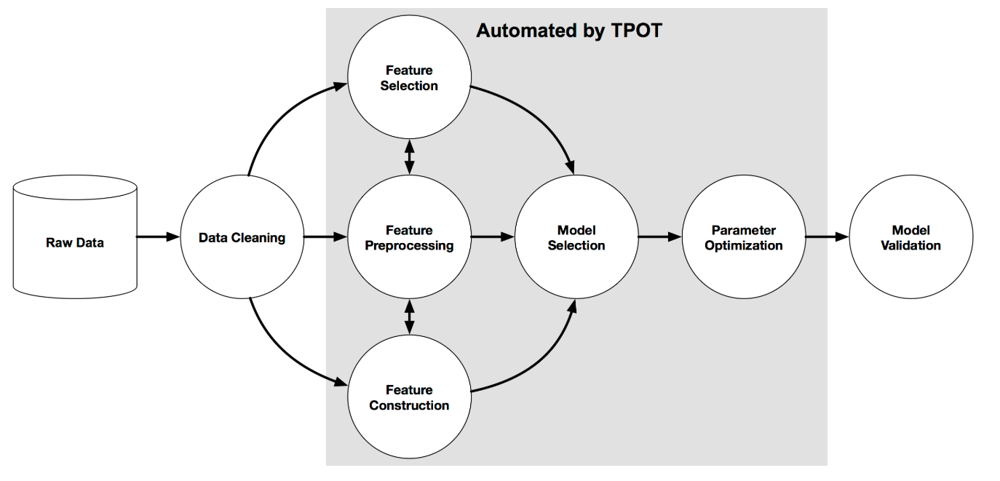

## Auto Machine Learning with TPOT

For part two of my automated machine learning series I am focusing on [TPOT](https://epistasislab.github.io/tpot/), a python library that uses genetic programming to optimize data science pipelines. TPOT's success and popularity has grown extrodinarily since its initial commit in late 2015. As of March 20, 2019, TPOT has 286 people watching, 5,441 stars, and 969 forks on [GitHub](https://github.com/EpistasisLab/tpot). 

TPOT stands for Tree-Based Pipeline Optimization Tool, and has the goal to help automate the development of ML pipelines by combining flexible tree representation of pipelines with stochastic search algorithms to develop the best scikit learn library possible. Once the the best predictive pipeline hsa been found, TPOT will export the pipeline as Python code so that a data scientist can continue developing from there. In addition to faster development and great models, my experience with TPOT is that it  great learning tool for newer data scientists who may want to understand how to develop better models manually.     

Like most automated machine learning libraries TPOT helps automated everything but data aquisition, data cleaning, and complex feature engineering for machine learning.   

  

In the first part of my automated machine learning series I evaluated the Azure Machine Learning Auto ML library. TPOT is similar in auto machine learning, however, it is unlike Azure Machine Learning because it is a standalone package meant for developing the best models while Azure ML is an end to end platform for managing and deploying models. In my experience TPOT is an excellent package that can be used in union with platforms like Azure ML and MLFlow.  

The best way to familiarize yourself with TPOT is to get started! Check out the demo I have created and the accompanying code on my [GitHub]().  

